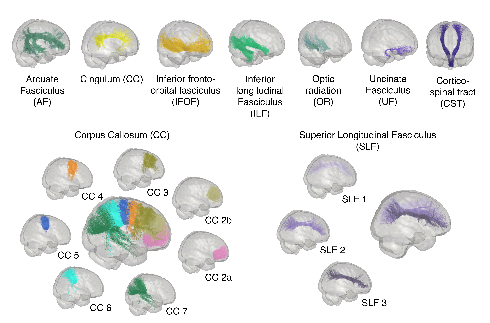

Bundles
=======

Bundles segmentation
--------------------

- For the segmentation of bundles we used `RecobundlesX <https://github.com/scilus/rbx_flow>`__

Bundles profiling
--------------------

- For the profiling bundles we used `Tractometry flow  <https://github.com/scilus/tractometry_flow>`__

.. image:: bundles_profiling.png
   :align: center
   :width: 700

Bundles reproducibility
------------------------

To minimize the impact of the variability of reconstruction by tractography on the measurements, 
we evaluate the bundle reproducibility as described in `Rheault et al. 2022 <https://doi.org/10.1002/hbm.25777>`_ (see also `Rheault et al. 2020 <https://doi.org/10.1002/hbm.24917>`_). 

Dice score, density correlation, streamline adjency and voxel adjency from all pairwise combinations are used to provide the 
agreement between segmentations of the same bundle across sessions.

See section  `Bundles reproducibility <https://high-frequency-mri-database-supplementary.readthedocs.io/en/latest/results/bundles_reproductibility.html>`_
for results. 

