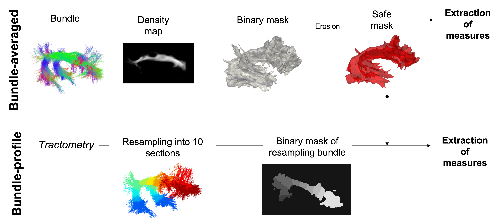

Consistency analysis
====================

The consistency analyses of each measure are carried out at the voxel-level within the bundle masks in common 
space using this `script`_.
The individual mask corresponding to each subject and session in the common space are provided as input. 
The overlap between masks across sessions and subjects is then performed as described in the consistency measures (See section `Consistency metrics <https://high-frequency-mri-database-supplementary.readthedocs.io/en/latest/pipeline/consistency_analysis.html#reliability>`_). 
Incomplete overlap of mask between subjects and sessions is compensated by densifying each measure in the affected 
regions voxel-wise, using the average value estimated from the available subjects or sessions. The averaged masks used 
for the computation of statistical measurements are then obtained subject-wise or session-wise by mathematical union. 

 .. _script: https://github.com/AlexVCaron/longitudinal_image_statistics

Bundle-averaged 
---------------

For each bundle, a density map is used to generate a binary mask of the whole bundle. 
To minimize the effect of partial volume, each whole bundle mask was eroded by one voxel to generate 
a conservative bundle mask that we called the “safe mask”. 

Bundle-profile
---------------

To generate the bundle-profile (also called track-profiles), `TractometryFlow`_ is applied to each subject-specific 
bundle to obtain 10 binary mask corresponding to 10 equidistant sections. Each binary mask is then intersected
with the safe mask. 

 .. _script: https://github.com/scilus/tractometry_flow

Left and right masks are merged for each average and section bundle mask.
Finally, DTI, HARDI, NODDI and MTI measurements are extracted for each average and profile masks
for each bundle over session to assess their distribution.

All steps to build the mask used `SCIL`_ scripts.

 .. _SCIL: http://scil.usherbrooke.ca/en/

Consistency metrics
--------------------
 

Reliability 
~~~~~~~~~~~

Image Intra-Class Correlation coefficient (I2C2, Shou et al., 2014), a generalization of the Intra-Class Correlation 
coefficient (ICC, Koo and Li, 2016, Bruton et al., 2000) to n-dimensional images (one-way random effect, absolute agreement)
was used to evaluate the reliability of MRI measurements.  

Variability 
~~~~~~~~~~~~

The variability induced by within-subject and between-subject effects on the measures is quantified using 
two coefficients of variation per measure: Within- and Between-Variability.  

  * Within-Variability (CVw)
  CVw is used to evaluate the dispersion of observations when repeatedly measuring a single individual (i.e., reproducibility). 
  It represents the amount of random error or noise contributing to the measure. 
  The CVw is first estimated per subject over their respective imaging sessions and then averaged across session.
  
  * Between-Variability (CVb)
  CVb is used to evaluate the sample heterogeneity. 
  The CVb is obtained by first averaging each subject session-wise, to then estimate the CV over those averages.
  

Results
--------------------

Results are displayed with `Plotly <https://plotly.com/python/>`__. 
The plots are interactives, click on the legend items to select and/or unselect the items.

See section `Consistency <https://high-frequency-mri-database-supplementary.readthedocs.io/en/latest/results/consistency.html>`_ for results. 

