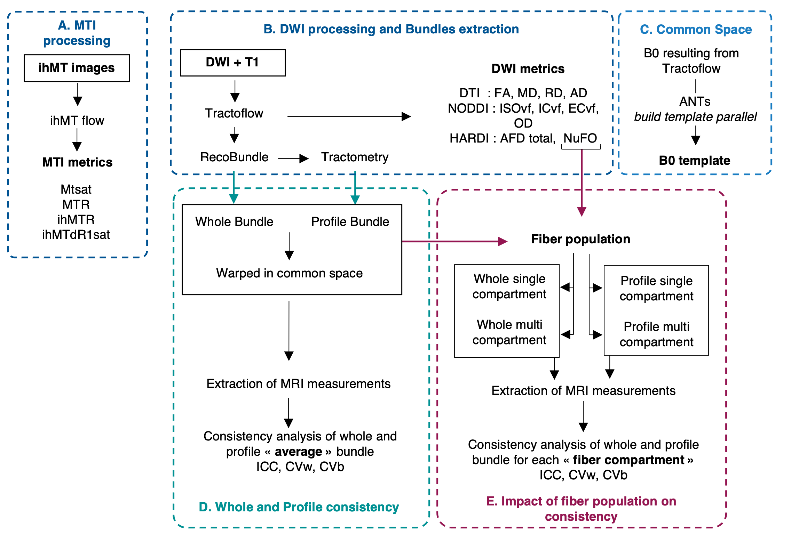

MRI Processing
=================

Tools
---------------

Tools used for all MRI images processing are available on `SCIL github <https://github.com/scilus>`__.
See https://scil-documentation.readthedocs.io/ for installation and documentation.

 - For DWI and T1 processing we used `Tractoflow <https://github.com/scilus/tractoflow>`__ and `NODDI <https://github.com/scilus/noddi_flow>`__
 
 - For ihMT processing we used `ihMTflow <https://github.com/scilus/ihmtflow>`__

   Processes and analyses overview. In A (blue), MTI input and output files using ihMT flow. In B (blue), the DWI process using Tractoflow to generate the tractograms and diffusion measures maps, the bundles' virtual segmentation using RecoBundlesX to obtain whole bundle mask, and bundles resampling using the Tractometry flow which provides bundle profile masks. In C (light blue), diffusion common space generation using ANTs. In D (green), consistency analyses of diffusion and myelin measures from the whole and profile bundle masks. In E (red) processes that take the NuFO map generated in B and the whole and profile bundle mask generated in D to separate them into single and multi compartments masks and perform consistency analyses of diffusion and myelin measures from these masks.

Metrics generated
-----------------
Table describe all metrics maps which will be evaluated.

+-------------------------------+-------------------------------------------+
| Tools                         | Generated images                          |
+===============================+===========================================+
| Tractoflow - DTI              | Fractional anisotropy (FA)                |
+-------------------------------+--------------------+----------------------+
|                               | Mean Diffusivity (MD)                     |
+-------------------------------+--------------------+----------------------+
|                               | Radial Diffusivity (AD)                   |
+-------------------------------+--------------------+----------------------+
|                               | Axial Diffusivity (AD)                    |
+-------------------------------+--------------------+----------------------+
| Tractoflow - HARDI            | Apparent fiber density total (AFD total)  |
+-------------------------------+--------------------+----------------------+
|                               | Number of fiber direction (NuFO)          |
+-------------------------------+--------------------+----------------------+
| NODDI flow                    | Intra-cellular volume fraction (ICvf)     |
+-------------------------------+--------------------+----------------------+
|                               | Extra-cellular volume fraction (ECvf)     |
+-------------------------------+--------------------+----------------------+
|                               | Isotropic volume fraction (ISOvf)         |
+-------------------------------+--------------------+----------------------+
|                               | Orientation direction (OD)                |
+-------------------------------+--------------------+----------------------+
| ihMT flow                     | ihMT ratio (ihMTR)                        |
+-------------------------------+--------------------+----------------------+
|                               | ihMT delta R1 saturation (ihMTdR1sat)     |
+-------------------------------+--------------------+----------------------+
|                               | MT ratio (MTR)                            |
+-------------------------------+--------------------+----------------------+
|                               | MT saturation (MTsat)                     |
+-------------------------------+--------------------+----------------------+

Quality Control
---------------
The visual quality assessment procedure was applied to the main steps according to the following criteria (using `DMRI QC <https://github.com/scilus/dmriqc_flow>`__):

+------------------+---------------------+-------------------------------------------------------------------+
|   MRI images     |         Step        |                        Exclusion criteria                         |
+==================+=====================+===================================================================+
|  T1, MTI, DWI    |  Raw data           | Presence of artifacts that cannot be corrected,                   |
|                  |                     | Incorrect field of view, Incorrect distribution of gradient (DWI) |
|                  |                     | Too high noise in the image, High inhomogeneity (MTI),            |
|                  |                     | Broken image, Missing part of the brain (T1, MTI)                 |
+------------------+---------------------+-------------------------------------------------------------------+
|  T1, MTI, DWI    | Brain extraction    | Eyes included in the brain mask,                                  |
|                  |                     | Exclusion of a part of the brain,                                 |
|                  |                     | Inclusion of a large part of the background in the brain mask     |
+------------------+---------------------+-------------------------------------------------------------------+
|      DWI         | Motion correction   | Alteration of bvecs,                                              |
|                  |                     | Remaining motion in the DWI,                                      |
|                  |                     | Presence of slice drop (at least in one direction)                |
+------------------+---------------------+-------------------------------------------------------------------+
|      DWI         | RGB                 | Invalid orientation in major WM structures,                       |
|                  |                     | Low FA value in expected structure (Corpus callosum for example), |
|                  |                     | Global color bias (indicating remaining motion)                   |
+------------------+---------------------+-------------------------------------------------------------------+
|  T1, MTI, DWI    | Registration        | Poor overlap between warped images and reference image            |
+------------------+---------------------+-------------------------------------------------------------------+
|     T1, DWI      | Mask                | Presence of holes in mask,                                        |
|                  |                     | Some part of mask missing                                         |
+------------------+---------------------+-------------------------------------------------------------------+
|      DWI         | Bundle segmentation | Unexpected shape,                                                 |
|                  |                     | Ends of bundle not in expected locations and/or without expected  |
|                  |                     | fanning,                                                          |
|                  |                     | A low number of streamlines                                       |
+------------------+---------------------+-------------------------------------------------------------------+
|      DWI         | Tract-profile       | Unexpected number of sections,                                    |
|                  |                     | Unbalanced sections                                               |
+------------------+---------------------+-------------------------------------------------------------------+
|    MTI, DWI      | Metrics map         | Unexpected range of value (FA > 1 for example),                   |
|                  |                     | Unexpected range of value in expected structure (low FA value in  |
|                  |                     | Corpus callosum for example)                                      |
+------------------+---------------------+-------------------------------------------------------------------+

  See section `Averaged measures in common space <https://high-frequency-mri-database-supplementary.readthedocs.io/en/latest/results/average_maps.html>`_   for an overview of each measurement. 

  See section `MRI quantitative measures <https://high-frequency-mri-database-supplementary.readthedocs.io/en/latest/results/measure.html>`_ for the    distribution of measurements.

